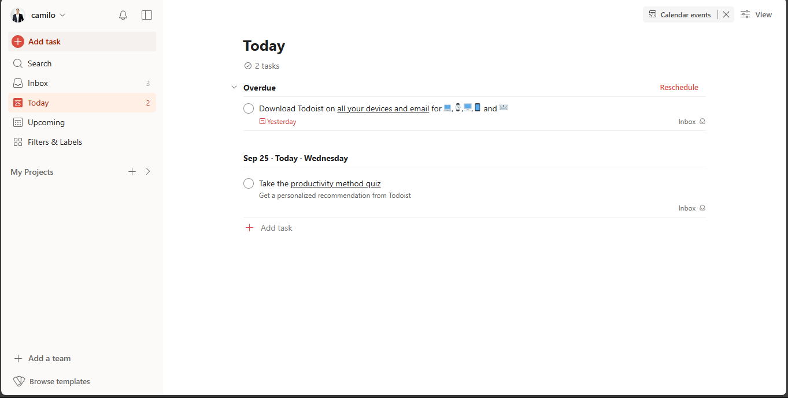

# todoist-clone



## comandos de inicio

```shell
$ git branch -M main
$ git remote add origin https://github.com/fullphantom/todoist-clone.git
$ git remote -v
$ git pull origin main
$ git log
```

## tareas pendientes

- 1.agregar el logo de todoist (fue agregado iconos svg en carpeta icons) (completada)
- 2.los colores que aparecen en la pagina (se agregaron colores globales en layout.astro) (completada)
- 3.Documentar comandos, los que hemos echo durante cada sesion de ahora en adelante (completada)
- 4.agregar iconos en svg (completada)
- 5.dentro de la carpeta componentes crear el componente, maquetar botones, item tarea contexto y textos

## tareas realizadas

- 1. agregar el logo de todoist (fue agregado iconos svg en carpeta icons)
- 2. los colores que aparecen en la pagina (se agregaron colores globales en layout.astro)
- 3. se agregó imagen avatar en carpeta pública

- 26/09/2024-

- 4. se creo las credenciales de google cloud para la autenticacion
- 5. se creo en la raiz del proyecto el archivo .env dentro se crea las variables GOOGLE_CLIENT_SECRET y GOOGLE_CLIENT_ID y se agrega la        informacion de cada uno
- 6. se detiene la terminal y se agrega el siguiente comando (npx astro add vercel) ejecutar codigo al lado del servidor y (npx astro add auth-astro) permite añadir la autenticacion 
- 7. se crea un archivo .env.dev como ejemplo para dar a entender que se debe anexar la coneccion a google cloud
- 8. en el archivo .env se agrega las variables AUTH_SECRET=<auth-secret> AUTH_TRUST_HOST=true y en la variable se crea un id hasheado que nos arroja la terminal con el comando (openssl rand -hex 32) y lo pegamos en aAUTH_SECRET=.
- 9. creamos un componente de autenticacion en componentes creamos el archivo GoogleSingIn.astro y dentro se agrega el codigo svg del boton de google
- 10. se da estilo al boton de inicio de sesion con google

- 27/09/2024

- 11. creamos el middelware.ts en la carpeta de src manejador de ruta y hace la validacion de la autenticacion del usuario y sirve para la proteccion de la ruta.
- 12. creamos archivo en carpeta components SignOut.astro
- 13. creamos archivo  en carpeta components Avatar.astro

## Hacer un pull request

- 1. confirmar los cambios

```shell
git add . // o git add nombre-del-archivo
git commit -m "Descripción de los cambios"
```

.png>)

- 2. subir los cambios

.png>)

```shell
git push origin main
```

- 3. En GitHub,
     .png>)
  - ve a tu repositorio forkeado
  - hacer clic en el botton contribuir
  - haz clic en New Pull Request.

.png>)

- 4. Revisa los cambios y luego haz clic en Create Pull Request.
- 5. Agrega un título y una descripción clara sobre los cambios.
- 6. Finalmente, envía el Pull Request y espera la revisión.

## Hacer sync fork

- 1. Sincronizar el proyecto desde github.


- 2. Desde la consola actualizamos el local.

```shell
git pull origin main
```


## referencias y tutotiales

[tutorial markdown](https://tutorialmarkdown.com/guia)

[tutorial islas](https://www.patterns.dev/vanilla/islands-architecture/)

[referencia base de datos turso](https://turso.tech/)

## referencias clase 27/09/2024

[guía gratuita de HTML. Incluye todos los elementos y atributos ](https://htmlreference.io/)

[guía visual gratuita de CSS. Presenta las propiedades más populares y las explica con ejemplos ilustrados y animados .](https://cssreference.io/)

[Estos recursos están diseñados para mejorar la experiencia en el desarrollo de frontend, independientemente de su nivel de experiencia.](https://freefrontend.com)


