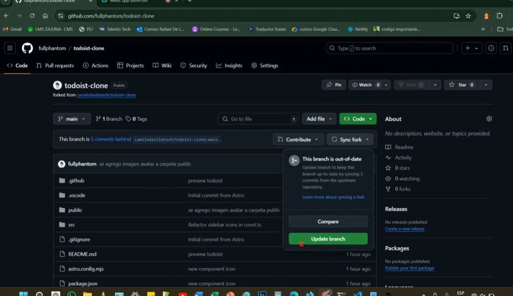
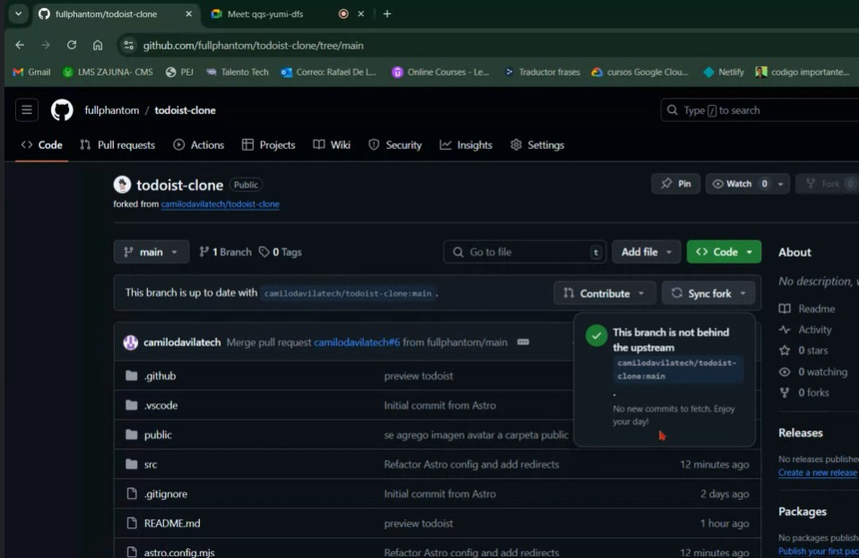
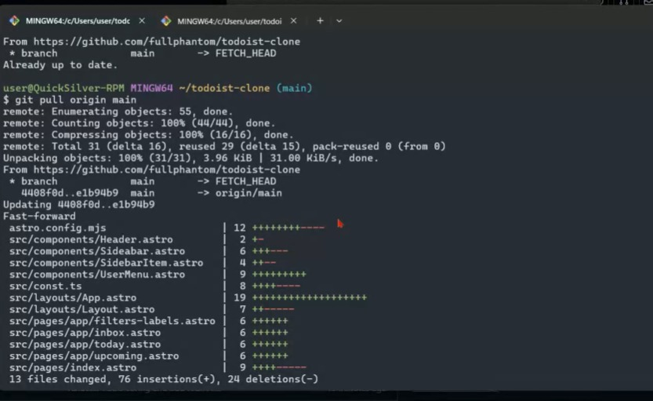
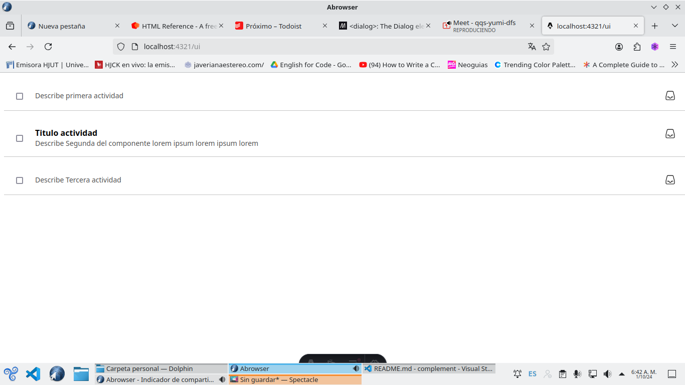

# todoist-clone


## comandos de inicio

```shell
git branch -M main
git remote add origin https://github.com/fullphantom/todoist-clone.git
git remote -v
git pull origin main
git log
```

## Tareas pendientes

- [x] agregar el logo de todoist (fue agregado iconos svg en carpeta icons) (completada)
- [x] los colores que aparecen en la pagina (se agregaron colores globales en layout.astro) (completada)
- [🏃] Documentar comandos, los que hemos echo durante cada sesion de ahora en adelante (completada)
- [x] agregar iconos en svg (completada)
- [🏃] dentro de la carpeta componentes crear el componente, maquetar botones, item tarea contexto y textos

## Tareas realizadas

- [x] agregar el logo de todoist (fue agregado iconos svg en carpeta icons)
- [x] los colores que aparecen en la pagina (se agregaron colores globales en layout.astro)
- [x] se agregó imagen avatar en carpeta pública

### 26/09/2024

- [x] se creo las credenciales de google cloud para la autenticacion
- [x] se creo en la raiz del proyecto el archivo .env dentro se crea las variables de entorno

```shell
GOOGLE_CLIENT_SECRET=""
GOOGLE_CLIENT_ID=""
```

- [x] se detiene la terminal y se agrega el siguiente comando (npx astro add vercel) ejecutar codigo al lado del servidor y (npx astro add auth-astro) permite añadir la autenticacion
- [x] se crea un archivo .env.dev como ejemplo para dar a entender que se debe anexar la coneccion a google cloud

```shell
AUTH_SECRET=auth-secret
AUTH_TRUST_HOST=true

# En la variable se crea un hash con openssl desde la terminal
```

```shell
openssl rand -hex 32
# lo pegamos en AUTH_SECRET=.
```

- [x] creamos un componente de autenticacion en componentes creamos el archivo `GoogleSignIn.astro` y dentro se agrega el codigo svg del boton de google
- [x] Se da estilo al boton de inicio de sesion con google

### 27/09/2024

1. creamos el middelware.ts en la carpeta de src manejador de ruta y hace la validacion de la autenticacion del usuario y sirve para la proteccion de la ruta.
2. creamos archivo en carpeta components SignOut.astro
3. creamos archivo en carpeta components Avatar.astro

## Hacer un pull request

- 1. confirmar los cambios

```shell
git add . // o git add nombre-del-archivo
git commit -m "Descripción de los cambios"
```

.png>)

- subir los cambios

.png>)

```shell
git push origin main
```

- En GitHub,
  .png>)
  - ve a tu repositorio forkeado
  - hacer clic en el botton contribuir
  - haz clic en New Pull Request.

.png>)

- Revisa los cambios y luego haz clic en Create Pull Request.
- Agrega un título y una descripción clara sobre los cambios.
- Finalmente, envía el Pull Request y espera la revisión.

## ESTRUCTURA BASE DE DATOS

```SQL
CREATE  TABLE users(
  id INTEGER PRIMARY KEY,
  first_name VARCHAR (100) NOT NULL,
  last_name VARCHAR(100) NOT NULL,
  avatar VARCHAR(100),
  email VARCHAR(100)
)
CREATE TABLE tasks(
id INTEGER PRIMARY KEY AUTOINCREMENT,
user_id INT,
title VARCHAR(225),
description VARCHAR(225),
date DATE,

FOREIGN KEY(user_id) REFERENCES users(id) ON DELETE CASCADE
)
```

## Hacer sync fork

- 1. Sincronizar el proyecto desde github.





- Desde la consola actualizamos el local.

```shell
git pull origin main
```



## instalar dependencia prettier clase 01/10/2024

1. instalar dependencias ->

   ```shell
   pnpm add -D prettier prettier-plugin-astro
   ```

```js
// .prettierrc.mjs
/\*_ @type {import("prettier").Config} _/;
export default {
  plugins: ["prettier-plugin-astro"],
};
```

2.crear un .prettierrc.mjs

```js
/** @type {import("prettier").Config} */
export default {
  plugins: ["prettier-plugin-astro"],
  overrides: [
    {
      files: "*.astro",
      options: {
        parser: "astro",
      },
    },
  ],
};
```

> fullphantom

## ejecutar configuración de eslint y prettier

```shell
pnpm run lint
```

## componentes



## referencias y tutotiales

[tutorial markdown](https://tutorialmarkdown.com/guia)

[tutorial islas](https://www.patterns.dev/vanilla/islands-architecture/)

[referencia base de datos turso](https://turso.tech/)

## referencias clase 27/09/2024

[guía gratuita de HTML. Incluye todos los elementos y atributos](https://htmlreference.io/)

[guía visual gratuita de CSS. Presenta las propiedades más populares y las explica con ejemplos ilustrados y animados .](https://cssreference.io/)

[Estos recursos están diseñados para mejorar la experiencia en el desarrollo de frontend, independientemente de su nivel de experiencia.](https://freefrontend.com)

## tener en cuenta

1. cada vez que se haga un comentario o crear un componentes poner el usuario de github
   en la seccion de los tres guiones se utiliza // y en la seccion del html se utili <!--comentarios-->
